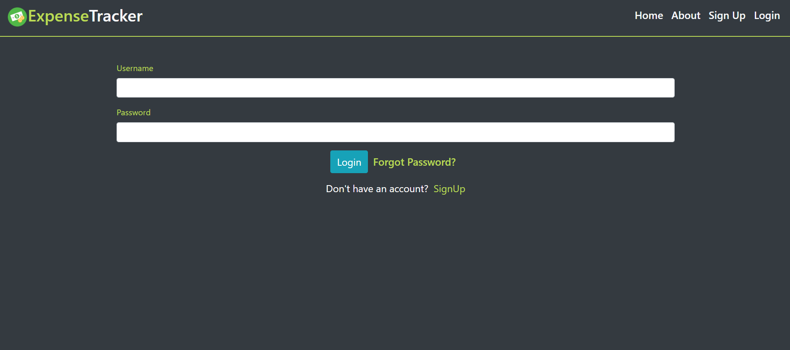
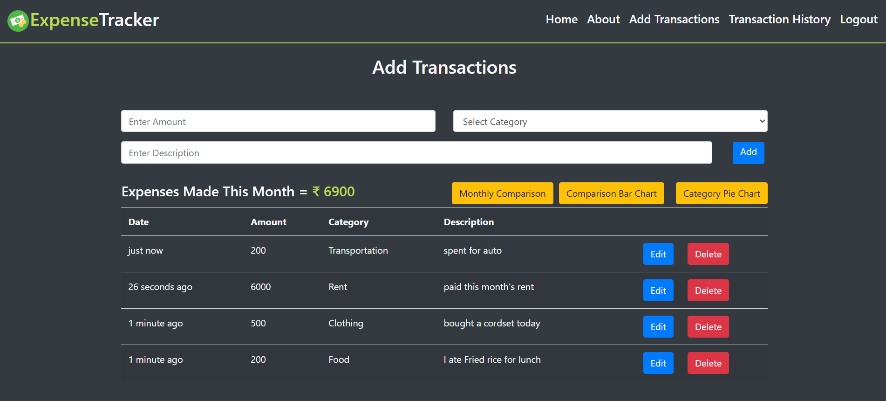
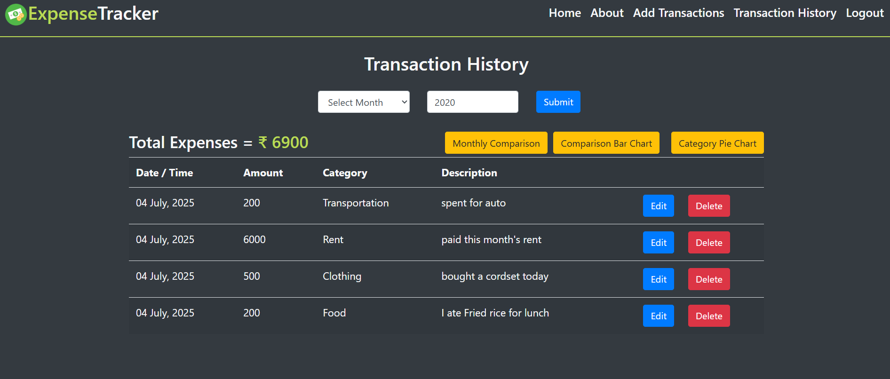
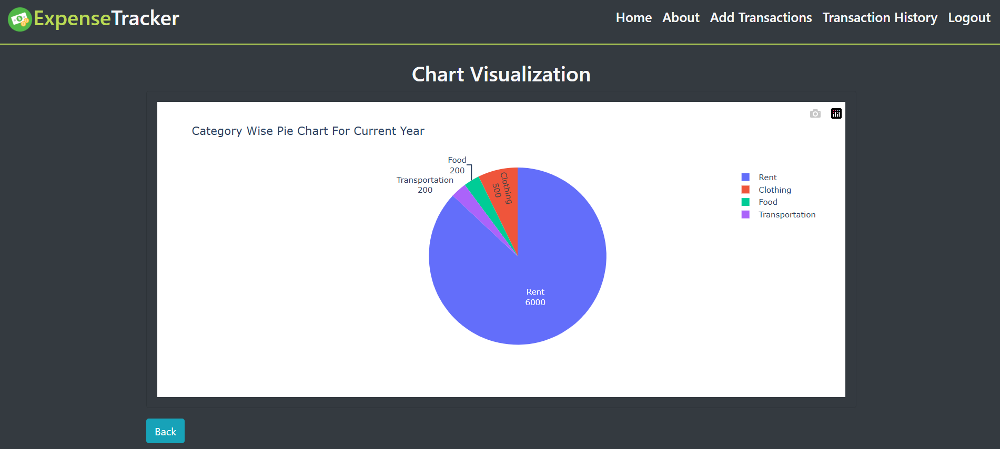
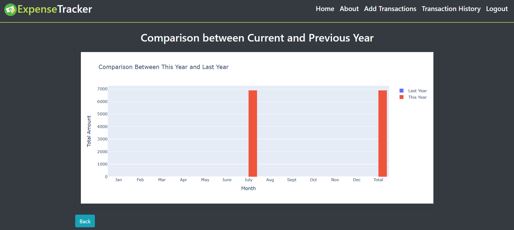
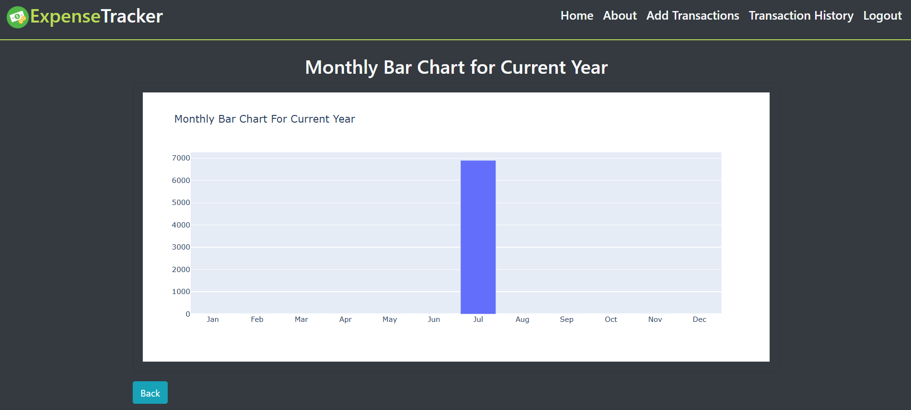

# Expense Tracker
This web application helps users track their daily expenses efficiently. Users can log their expenses, view their transaction history, and analyze their spending patterns using visual charts. The app provides month-wise and year-wise summaries and enables comparisons across different time periods.

## Features
- User Authentication: Sign up, log in, and manage your account securely.

- Add Transactions: Input daily expenses with ease.

- View History: Filter and view expense history by month and year.

- Data Visualization:

  - Category-wise Pie Chart (Yearly)

  - Monthly Line Chart (Current Month)

  - Year-over-Year Comparison Bar Chart

- Password Reset via Email: Reset your password with a secure email link.

- Mobile Responsive: Works well on mobile, tablet, and desktop.

## Requirements
Make sure you have the following installed on your system:

- Python (3.x recommended)

- pip package manager

- MySQL server running locally

### Set your MySQL password as an environment variable:

```bash
export MYSQL_PWD=your_mysql_password
```
### Install dependencies:

```bash
pip install flask
pip install mysqlclient
pip install flask-mysqldb
pip install flask-WTF
pip install passlib
```
## Quick Start
### Clone the repository:

``` bash
git clone https://github.com/Meenakshi233/BudgetBook
cd Expense-Tracker
``` 
### Set up the database:

Make sure MySQL is running.

### Execute the SQL file to create necessary tables:

``` bash
mysql -u root < queries.sql
```
### Run the application:

```bash
python app.py
```
Open your browser and navigate to: http://localhost:5000

## Screenshots
Below are the key pages of the application:

### Sign Up Page


### Login Page


### Add Transaction Page


### Transaction History Page


### Category-Wise Pie Chart (Yearly)


### Year-over-Year Comparison


### Daily Line Chart (Current Month)


## Password Recovery
If a user forgets their password, they can request a reset link via email. Clicking the link will redirect them to a page to update their password securely.

## Project Structure (Highlights)
<pre><code>```cpp 
  Expense-Tracker/ 
  │ 
  ├── app.py 
  ├── templates/ 
  │ ├── login.html 
  │ ├── register.html 
  │ ├── dashboard.html 
  │ 
  └── ... 
  ├── static/ 
  │ ├── css/ 
  │ ├── js/ 
  │ └── images/ 
  ├── queries.sql 
  └── README.md ```</code></pre>
